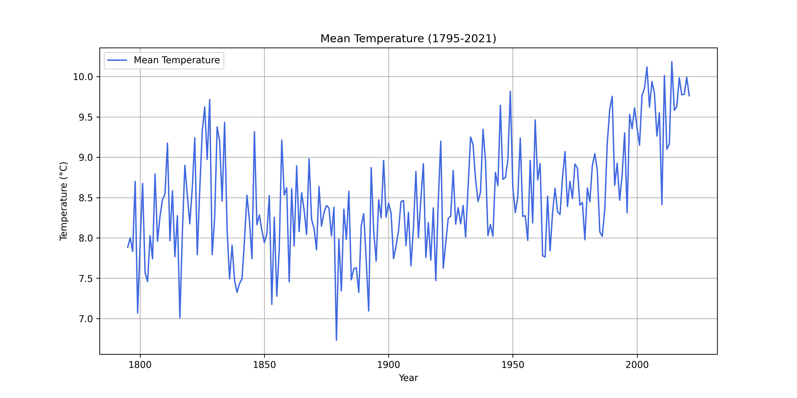
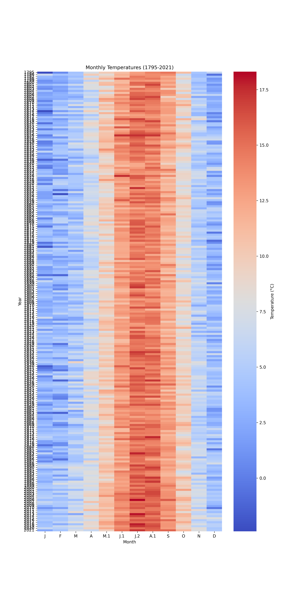

# Temperature Analysis (1795-2021)

## Summary Statistics
| T (&deg;C)         | J | F | M | A | M.1 | J.1 | J.2 | A.1 | S | O | N | D |
| ------------------ | ---- | ---- | ---- | ---- | ---- | ---- | ---- | ---- | ---- | ---- | ---- | ---- |
| Mean               | 2.89 | 3.48 | 4.91 | 7.17 | 9.97 | 13.07 | 14.92 | 14.63 | 12.45 | 9.14 | 5.61 | 3.66 |
| Median             | 3.09 | 3.71 | 4.80 | 7.10 | 10.05 | 13.03 | 14.85 | 14.60 | 12.50 | 9.10 | 5.60 | 3.74 |
| Standard deviation | 1.72 | 1.72 | 1.56 | 1.28 | 1.29 | 1.15 | 1.20 | 1.12 | 1.15 | 1.35 | 1.33 | 1.64 |
## Mean Temperature Over Time (1795-2021)

## Monthly Temperature Heatmap (1795-2021)

